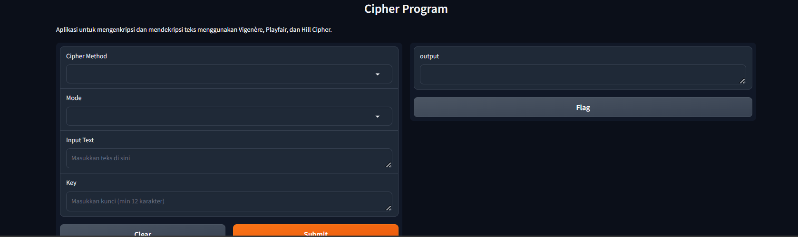

# Langkah-Langkah Menjalankan Program

1. **Pilih Metode Cipher**: 
   - Tentukan cipher yang akan Anda gunakan (misalnya **Vigenère**, **Playfair**, atau **Hill**).
   
2. **Input Teks**:
   - Masukkan teks biasa (plaintext) ke dalam kolom "Input Text" sebagai contoh plainteks.

3. **Input Kunci**:
   - Masukkan kunci enkripsi yang valid dengan panjang minimal **12 karakter**.

4. **Pilih Mode**:
   - Pilih mode **Encrypt** untuk menghasilkan cipherteks dari plainteks yang Anda masukkan.

5. **Submit**:
   - Klik tombol **Submit** untuk melihat hasil cipherteks di sebelah kanan.

Berikut ini tampilan sederhana dari antarmuka berbasis Gradio yang digunakan untuk mengenkripsi dan mendekripsi teks.

